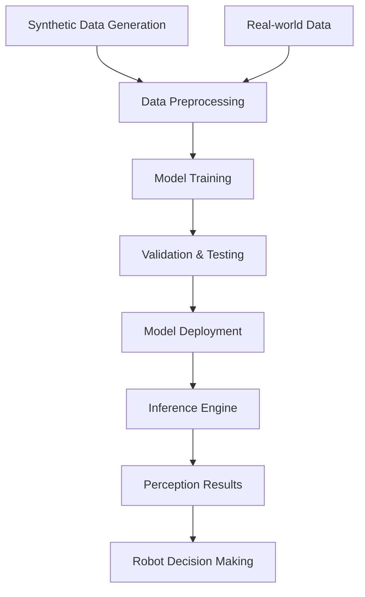

# AI Perception & Training Concepts

## Overview

AI perception in robotics involves using machine learning models to help robots understand and interpret their environment. This includes object detection, recognition, scene understanding, and other perception tasks that enable intelligent robot behavior. The use of synthetic data for training these models is a key advantage of simulation-based development.

## Learning Objectives

After completing this section, you will be able to:
- Explain the role of AI perception in robot systems
- Understand synthetic data generation for AI training
- Identify performance considerations for AI perception
- Evaluate simulation-to-reality transfer effectiveness

## AI Perception in Robotics

AI perception encompasses several key capabilities:
- **Object Detection and Recognition**: Identifying objects in the environment
- **Scene Understanding**: Interpreting spatial relationships and context
- **Semantic Segmentation**: Understanding pixel-level classifications
- **Pose Estimation**: Determining the position and orientation of objects
- **Activity Recognition**: Understanding dynamic events and behaviors

## Synthetic Data for AI Training

Synthetic data generation offers several advantages:
- **Labeled Ground Truth**: Perfect annotations for training
- **Diverse Scenarios**: Controlled variation of environmental conditions
- **Safety**: Training without real-world risks
- **Cost-Effectiveness**: No need for expensive data collection
- **Scalability**: Generate unlimited training examples

## Training Pipeline Architecture

A typical AI perception training pipeline includes:
- **Data Generation**: Creating synthetic datasets in simulation
- **Model Architecture**: Designing neural networks for perception tasks
- **Training Process**: Optimizing models with synthetic and real data
- **Validation**: Testing model performance in simulation and reality
- **Deployment**: Running inference on robot hardware

## Hardware Acceleration for AI Perception

Modern robotics leverages hardware acceleration for AI perception:
- **GPUs**: Parallel processing for neural network inference
- **Tensor Cores**: Specialized hardware for AI computations
- **Edge AI Chips**: Optimized for power-efficient inference
- **CUDA/TensorRT**: Optimization frameworks for NVIDIA hardware

## Simulation-to-Reality Transfer

The process of transferring models trained on synthetic data to real-world applications:
- **Domain Randomization**: Varying simulation parameters to improve generalization
- **Adaptation Techniques**: Fine-tuning models with limited real data
- **Performance Validation**: Comparing synthetic vs. real-world performance
- **Transfer Learning**: Adapting pre-trained models to new domains

## Performance Considerations

Key factors affecting AI perception performance:
- **Latency**: Real-time processing requirements
- **Accuracy**: Trade-offs between speed and precision
- **Resource Usage**: Computational and memory requirements
- **Robustness**: Performance under varying conditions
- **Power Consumption**: Especially important for mobile robots

## Integration with Isaac Ecosystem

AI perception integrates with the Isaac ecosystem:
- **Isaac Sim**: For synthetic data generation
- **Isaac ROS**: For hardware-accelerated inference
- **Nav2**: For using perception results in navigation
- **ROS 2**: For system integration and communication

## Hands-on Exercise

Explore AI perception concepts with synthetic data:

1. Generate synthetic sensor data in Isaac Sim
2. Train a simple perception model (conceptual)
3. Deploy the model using Isaac ROS
4. Evaluate performance in simulation

## Summary

AI perception is a critical component of the AI-robot brain, enabling robots to understand and interact with their environment. The combination of synthetic data generation and hardware acceleration provides powerful tools for developing robust perception systems.