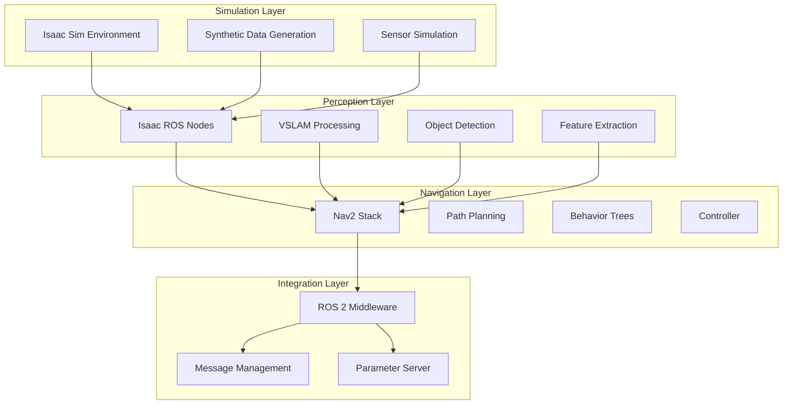

# Integration Workflows and Best Practices

## Overview

Creating an effective AI-robot brain requires seamless integration between Isaac Sim, Isaac ROS, and Nav2. This chapter covers the essential patterns, best practices, and workflows for connecting these systems into a unified platform that enables intelligent robot behavior.

## Learning Objectives

After completing this section, you will be able to:
- Implement best practices for Isaac integration
- Design effective communication patterns between systems
- Manage data flow efficiently across components
- Apply performance optimization techniques

## Integration Architecture

The integration of Isaac technologies follows a layered architecture:

- **Simulation Layer**: Isaac Sim provides the virtual environment and sensor data
- **Perception Layer**: Isaac ROS processes sensor data and extracts meaningful information
- **Navigation Layer**: Nav2 plans and executes movement based on perception data
- **Integration Layer**: ROS 2 manages communication and data flow between components



## Communication Patterns

Effective integration relies on proper communication patterns:

### Message-Based Communication
- Use standard ROS 2 message types where possible
- Implement custom message types for Isaac-specific data
- Apply appropriate Quality of Service (QoS) settings for real-time performance

### Service-Based Communication
- Use services for configuration and control operations
- Implement action servers for long-running tasks
- Apply proper error handling and timeouts

### Parameter-Based Configuration
- Centralize configuration through ROS 2 parameters
- Use parameter files for Isaac-specific settings
- Implement dynamic reconfiguration where appropriate

## Data Flow Management

Managing data flow efficiently is crucial for performance:

### Sensor Data Pipeline
1. Sensor data from Isaac Sim
2. Preprocessing in Isaac ROS nodes
3. Feature extraction and processing
4. Publication to navigation and decision systems

### Navigation Data Pipeline
1. Perception results from Isaac ROS
2. Map updates and localization
3. Path planning and execution
4. Feedback to perception for refinement

### Performance Optimization
- Minimize data copying between components
- Use zero-copy transport where possible
- Implement proper buffering and queuing
- Monitor and optimize data rates

## Best Practices for Isaac Integration

### System Design Principles
- **Modularity**: Keep components loosely coupled
- **Scalability**: Design for increasing complexity
- **Maintainability**: Use clear interfaces and documentation
- **Robustness**: Handle failures gracefully

### Performance Considerations
- Profile each component individually
- Monitor resource usage (CPU, GPU, memory)
- Optimize communication patterns
- Implement appropriate error recovery

### Hardware Acceleration Integration
- Leverage GPU for perception tasks
- Use TensorRT for optimized inference
- Optimize memory transfers between CPU and GPU
- Implement asynchronous processing where possible

## Launch File Configuration

Proper launch file configuration is essential for integration:

```python
# Example launch file structure
from launch import LaunchDescription
from launch_ros.actions import Node
from launch.actions import DeclareLaunchArgument
from launch.substitutions import LaunchConfiguration

def generate_launch_description():
    # Isaac Sim integration
    isaac_sim_node = Node(
        package='isaac_examples',
        executable='isaac_sim_integration',
        name='isaac_sim_bridge',
        parameters=[...]
    )

    # Isaac ROS perception pipeline
    perception_node = Node(
        package='isaac_examples',
        executable='perception_pipeline',
        name='perception_pipeline',
        parameters=[...]
    )

    # Nav2 navigation
    nav2_node = Node(
        package='isaac_examples',
        executable='nav2_configurator',
        name='nav2_configurator',
        parameters=[...]
    )

    return LaunchDescription([
        isaac_sim_node,
        perception_node,
        nav2_node,
    ])
```

## Troubleshooting Integration Issues

Common integration challenges and solutions:
- **Timing issues**: Synchronize clocks and use appropriate time synchronization
- **Data rate mismatches**: Implement proper buffering and throttling
- **Parameter conflicts**: Use namespace separation and clear parameter organization
- **Resource contention**: Monitor and optimize resource allocation

## Hands-on Exercise

Implement an integrated system with Isaac Sim, Isaac ROS, and Nav2:

1. Configure the simulation environment
2. Set up perception pipeline
3. Connect to navigation system
4. Test the integrated workflow
5. Optimize performance

## Summary

Effective integration of Isaac Sim, Isaac ROS, and Nav2 creates a powerful AI-robot brain that can perceive, plan, and navigate in complex environments. Following best practices for communication, data flow, and performance optimization ensures a robust and scalable system.