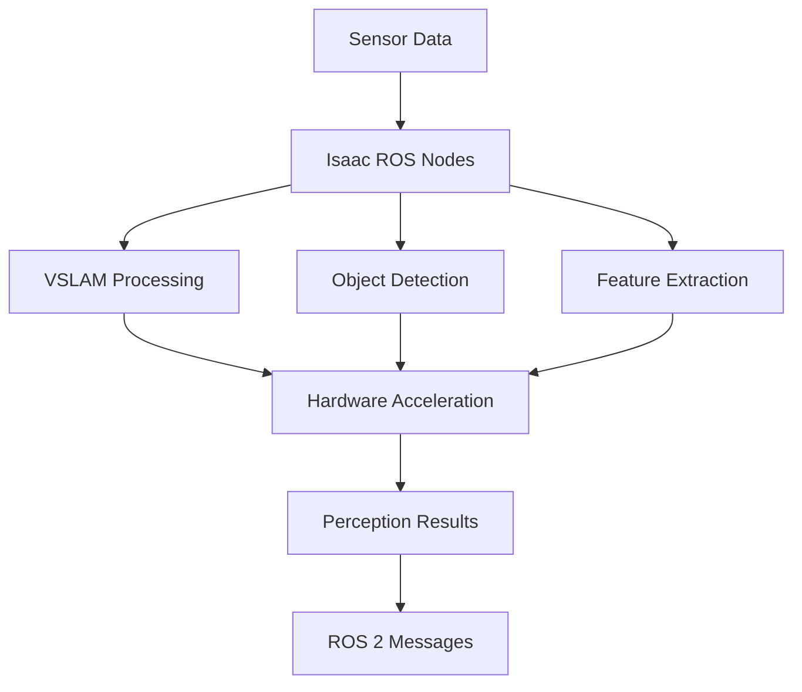

# Isaac ROS for Hardware-Accelerated Perception

## Overview

Isaac ROS is NVIDIA's collection of hardware-accelerated perception packages that enable robots to perceive and understand their environment. These packages leverage NVIDIA's GPU computing capabilities to provide real-time performance for complex perception tasks like VSLAM (Visual Simultaneous Localization and Mapping).

## Learning Objectives

After completing this section, you will be able to:
- Explain the Isaac ROS architecture
- Configure Isaac ROS perception nodes
- Implement VSLAM using Isaac ROS
- Understand the benefits of hardware acceleration

## Isaac ROS Architecture

Isaac ROS packages are designed to work with the Robot Operating System (ROS 2) and leverage NVIDIA's GPU computing capabilities:

- **Hardware Acceleration Layer**: CUDA and TensorRT for optimized computation
- **Perception Algorithms**: VSLAM, object detection, pose estimation
- **ROS 2 Integration**: Standard message types and interfaces
- **Performance Optimization**: Memory management and data pipeline efficiency

## Hardware Acceleration Benefits

Isaac ROS leverages NVIDIA's hardware acceleration to provide significant performance improvements:

- **CUDA**: Parallel computing platform for GPU acceleration
- **TensorRT**: High-performance inference optimizer
- **Hardware-accelerated image processing**: Direct GPU memory access
- **Optimized memory transfers**: Minimized CPU-GPU data movement

## VSLAM with Isaac ROS

Visual SLAM (Simultaneous Localization and Mapping) is a key capability provided by Isaac ROS:

- **Visual Inertial Odometry (VIO)**: Combines visual and IMU data for robust tracking
- **Feature tracking**: GPU-accelerated feature detection and matching
- **Map building**: Real-time construction of 3D maps
- **Loop closure**: Recognition of previously visited locations

## Setting Up Isaac ROS Perception

### Prerequisites
- NVIDIA GPU with CUDA support
- Isaac ROS packages installed
- ROS 2 environment configured

### Basic Setup Steps
1. Configure sensor parameters
2. Set up hardware acceleration
3. Launch perception nodes
4. Monitor performance metrics

## Performance Optimization

Isaac ROS provides several optimization techniques:
- Pipeline parallelization
- Memory pool management
- Asynchronous processing
- GPU memory optimization

## Hands-on Exercise

Implement a basic VSLAM pipeline using Isaac ROS:

1. Configure camera and IMU sensors
2. Launch Isaac ROS VSLAM nodes
3. Monitor tracking performance
4. Evaluate mapping accuracy

## Summary

Isaac ROS provides powerful, hardware-accelerated perception capabilities that enable robots to understand their environment in real-time. Understanding these tools is essential for building AI-robot brain applications with advanced perception capabilities.