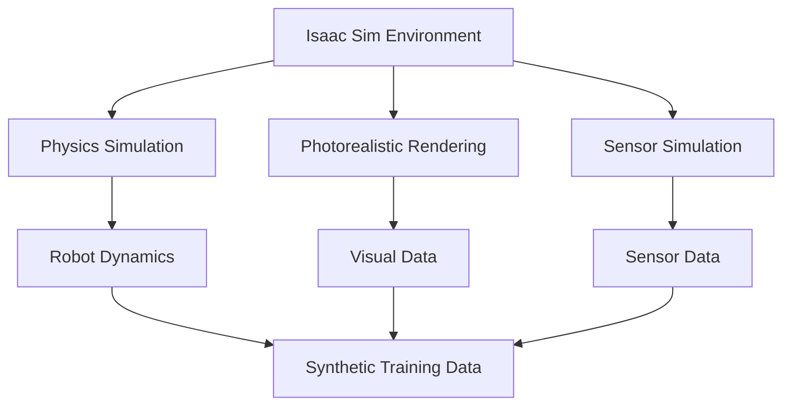

# Isaac Sim Fundamentals for Photorealistic Simulation

## Overview

NVIDIA Isaac Sim is a comprehensive simulation environment that provides photorealistic simulation capabilities for robotics development. It enables the generation of synthetic data for AI training and testing robot algorithms in realistic environments without the need for physical hardware.

## Learning Objectives

After completing this section, you will be able to:
- Explain the architecture of Isaac Sim
- Set up a basic simulation environment
- Create and configure robot assets in Isaac Sim
- Understand synthetic data generation capabilities

## Isaac Sim Architecture

Isaac Sim is built on NVIDIA Omniverse, which provides a collaborative platform for 3D design and simulation. The architecture includes:

- **Simulation Engine**: PhysX for physics simulation and rendering capabilities
- **Robot Assets**: Pre-built and customizable robot models
- **Environment Generation**: Tools for creating realistic environments
- **Sensor Simulation**: Photorealistic camera, LiDAR, and other sensor simulation
- **Synthetic Data Generation**: Tools for generating labeled training data

## Setting Up Isaac Sim

### Prerequisites
- NVIDIA GPU with CUDA support
- Compatible NVIDIA drivers
- Isaac Sim installation

### Basic Environment Setup

1. Launch Isaac Sim
2. Create a new stage or open an existing one
3. Configure the physics settings
4. Add lighting and environment assets

## Creating Robot Assets

Isaac Sim provides tools for creating and configuring robot assets:

- Import URDF/SDF models
- Configure joint properties
- Add sensors and actuators
- Set up kinematic chains

## Sensor Simulation

Isaac Sim provides photorealistic sensor simulation:
- RGB cameras with realistic distortion
- Depth sensors
- LiDAR with configurable parameters
- IMU sensors
- Force/torque sensors

## Synthetic Data Generation

One of the key advantages of Isaac Sim is its ability to generate synthetic training data:
- Labeled sensor data
- Ground truth information
- Diverse environmental conditions
- Various lighting scenarios

## Hands-on Exercise

Create a basic simulation environment with a humanoid robot and configure sensor simulation to generate synthetic data.

1. Launch Isaac Sim
2. Import a humanoid robot model
3. Configure RGB and depth cameras
4. Set up a simple environment
5. Run the simulation and observe sensor outputs

## Summary

Isaac Sim provides a powerful platform for robotics development through photorealistic simulation and synthetic data generation. Understanding its fundamentals is crucial for leveraging its capabilities in AI-robot brain applications.