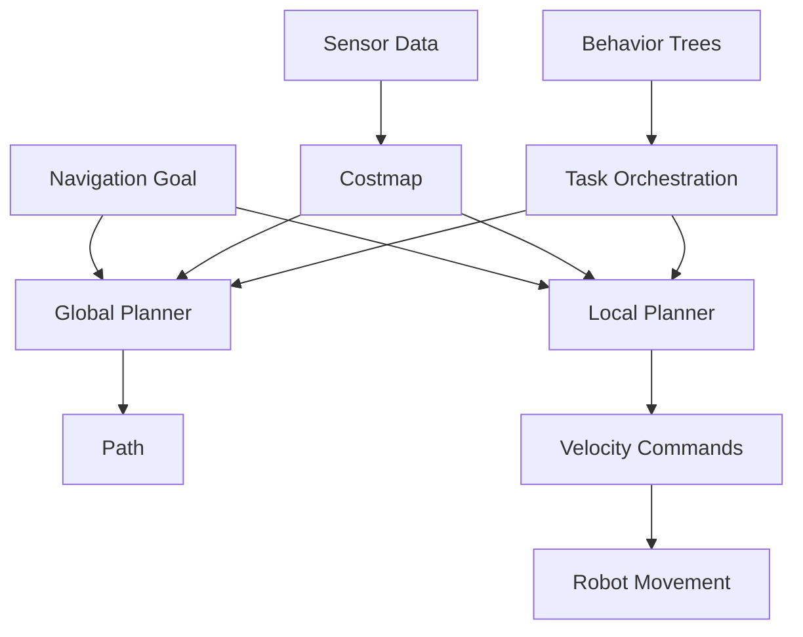

# Nav2 for Advanced Path Planning and Navigation

## Overview

Navigation2 (Nav2) is the state-of-the-art navigation stack for ROS 2 that provides AI-enhanced path planning and navigation capabilities. It is designed to work with various robot types and can be customized for specific applications, including humanoid robots with unique locomotion requirements.

## Learning Objectives

After completing this section, you will be able to:
- Explain Nav2 architecture and components
- Configure navigation for humanoid robots
- Implement custom behaviors for bipedal movement
- Understand navigation in complex environments

## Nav2 Architecture

Nav2 consists of several key components that work together to provide navigation capabilities:

- **Global Planner**: Computes the overall path from start to goal
- **Local Planner**: Handles obstacle avoidance and local path following
- **Costmap**: Maintains obstacle information and robot footprint
- **Behavior Trees**: Orchestrates navigation tasks and recovery behaviors
- **Controllers**: Executes motion commands to follow the path

## Path Planning Algorithms

Nav2 includes several path planning algorithms:
- **Global Planners**: A*, Dijkstra, NavFn, GridBasedPlanners
- **Local Planners**: DWA, Trajectory Rollout, TEB (Timed Elastic Band)
- **Smoothers**: Path optimization and smoothing algorithms

## Behavior Trees in Nav2

Behavior trees provide a flexible way to orchestrate navigation tasks:
- **Action Nodes**: Execute specific navigation tasks
- **Condition Nodes**: Check for specific conditions
- **Control Nodes**: Manage the flow of execution
- **Recovery Nodes**: Handle navigation failures and obstacles

## Humanoid-Specific Navigation

Humanoid robots have unique navigation requirements:
- **Bipedal locomotion**: Different movement patterns than wheeled robots
- **Stability considerations**: Balance and fall prevention
- **Footstep planning**: Planning where to place feet
- **Dynamic balance**: Maintaining balance during movement

## Costmap Configuration

Costmaps are crucial for navigation and need to be configured properly:
- **Static Layer**: Static map information
- **Obstacle Layer**: Dynamic obstacle detection
- **Inflation Layer**: Safety margins around obstacles
- **Voxel Layer**: 3D obstacle information

## Configuration for Humanoid Robots

Special considerations for humanoid robot navigation:
- Larger robot footprint for stability
- Custom cost functions for bipedal movement
- Specialized controllers for legged locomotion
- Balance-aware path planning

## Hands-on Exercise

Configure Nav2 for a humanoid robot simulation:

1. Set up costmap parameters for humanoid dimensions
2. Configure behavior trees for humanoid navigation
3. Test navigation in a simple environment
4. Evaluate path planning performance

## Summary

Nav2 provides a comprehensive navigation solution that can be adapted for humanoid robots with proper configuration. Understanding its architecture and components is essential for implementing effective navigation in AI-robot brain applications.