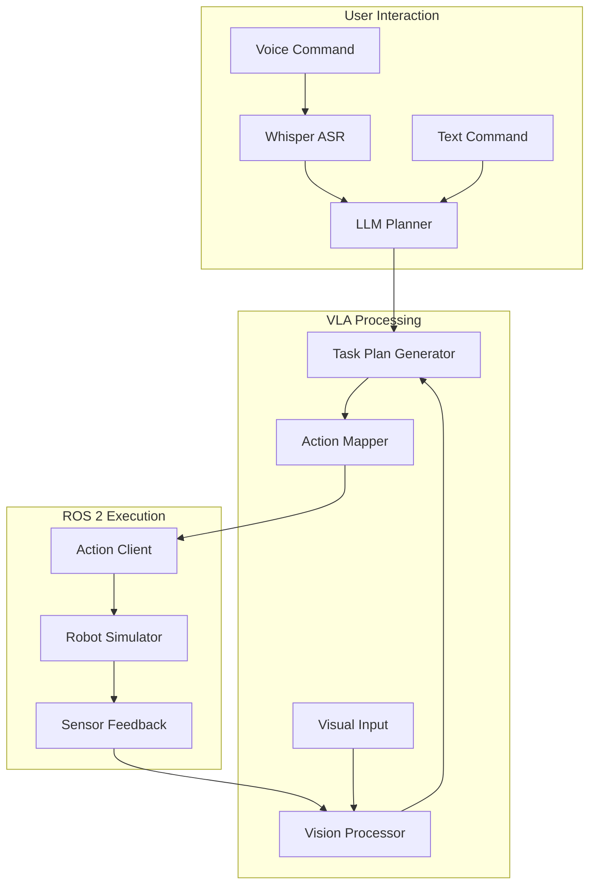

# VLA Architecture

## Overview

The Vision-Language-Action (VLA) system architecture is designed to process natural language commands, interpret visual information, and execute appropriate robotic actions in a simulated environment.

## System Architecture

## Component Breakdown

### 1. Voice Processing Layer
- **Whisper ASR**: Converts speech to text
- **Audio Preprocessing**: Normalizes and filters audio input
- **Command Validation**: Ensures recognized commands are valid

### 2. Language Understanding Layer
- **LLM Planner**: Generates task plans from natural language
- **Intent Recognition**: Identifies user intentions
- **Entity Extraction**: Identifies objects, locations, and actions

### 3. Vision Processing Layer
- **Image Processing**: Handles camera input
- **Object Detection**: Identifies objects in the environment
- **Scene Understanding**: Interprets spatial relationships

### 4. Action Planning Layer
- **Task Decomposition**: Breaks complex tasks into simpler steps
- **Action Sequencing**: Orders actions appropriately
- **Safety Validation**: Ensures actions are safe to execute

### 5. ROS 2 Interface Layer
- **Action Clients**: Communicates with robot actions
- **Message Definitions**: Standardizes communication
- **Feedback Handling**: Processes execution results

## Data Flow

1. User provides voice command
2. Whisper converts speech to text
3. LLM interprets the command and generates a task plan
4. Vision system provides environmental context
5. Action mapper translates plan to ROS 2 actions
6. Robot simulator executes actions
7. Feedback is processed to validate completion

## Communication Protocols

- Audio data: microphone → audio processing node
- Image data: camera → vision processing node
- Commands: command node → action planner
- Actions: action planner → ROS 2 action servers
- Feedback: sensor nodes → monitoring system