# VLA Module - Capstone Preparation Materials

## Overview

This document provides preparation materials for the capstone project that integrates all modules of the robotics course. The Vision-Language-Action (VLA) module represents the culmination of the course, demonstrating how voice command input, LLM-based task planning, vision-based perception, Nav2 navigation, and ROS 2 action execution work together in an autonomous humanoid robot system.

## Capstone Goal

**Demonstrate an end-to-end Physical AI system where a humanoid robot understands a voice command, plans, navigates, and acts autonomously in simulation.**

### Core Capstone Flow
```
Voice Command → LLM Planning → Vision Perception → Nav2 Navigation → ROS 2 Actions
```

## Integration Architecture

### System Architecture Diagram

```mermaid
graph TB
    subgraph "User Interface"
        A["🎤 Voice Command Input"] --> B["💬 LLM-Based Task Planning"]
    end

    subgraph "Perception System"
        C["👁️ Vision-Based Perception"]
    end

    subgraph "Navigation System"
        D["🧭 Nav2 Navigation"]
    end

    subgraph "Action System"
        E["🤖 ROS 2 Action Execution"]
    end

    subgraph "Simulation Environment"
        F["🎮 Gazebo/Isaac Sim"]
    end

    B --> C
    C --> D
    D --> E
    C --> F
    D --> F
    E --> F

    subgraph "VLA Orchestrator"
        G["🔄 Central Coordination"]
    end

    B --> G
    C --> G
    D --> G
    E --> G
    G --> B
    G --> C
    G --> D
    G --> E
```


### Data Flow Architecture
```
┌─────────────────┐    ┌──────────────────┐    ┌─────────────────┐
│   Voice Input   │───▶│   LLM Planner   │───▶│  Perception     │
│                 │    │                  │    │   System        │
│ • Raw audio     │    │ • Task planning  │    │ • Object det.   │
│ • STT conversion│    │ • Decomposition  │    │ • Scene und.    │
│ • Command prep. │    │ • Reasoning      │    │ • Spatial rel.  │
└─────────────────┘    └──────────────────┘    └─────────────────┘
         │                       │                        │
         ▼                       ▼                        ▼
┌─────────────────┐    ┌──────────────────┐    ┌─────────────────┐
│ Navigation      │───▶│ Action Executor │───▶│ Simulation      │
│ System          │    │                 │    │ Environment     │
│ • Path planning │    │ • Action mapping│    │ • Physics sim   │
│ • Obstacle avoid│    │ • Feedback proc.│    │ • Sensor sim    │
│ • Goal tracking │    │ • Execution mon.│    │ • Robot model   │
└─────────────────┘    └──────────────────┘    └─────────────────┘
```

## Voice Command Processing

### Voice-to-Text Pipeline
```python
# Example voice command processing flow
voice_input = capture_audio()
text_command = speech_to_text(voice_input)
structured_command = parse_command(text_command)
```

### Supported Command Types
1. **Navigation Commands**
   - "Go to the kitchen"
   - "Navigate to the living room"
   - "Move to the charging station"

2. **Manipulation Commands**
   - "Pick up the red cup"
   - "Grasp the blue book"
   - "Place the object on the table"

3. **Perception Commands**
   - "Find the red cup"
   - "Detect objects in the room"
   - "Look for the chair"

4. **Complex Commands**
   - "Go to the kitchen and find the red cup"
   - "Navigate to the living room and pick up the blue book"

## LLM-Based Task Planning

### Planning Architecture
The LLM planning system decomposes high-level commands into executable action sequences:

```
High-Level Command: "Go to kitchen and find red cup"
                    ↓
           [Task Decomposition]
                    ↓
    ┌─────────────────────────────┐
    │ 1. Navigate to kitchen      │
    │ 2. Detect red cup           │
    │ 3. Report findings          │
    └─────────────────────────────┘
                    ↓
           [Action Sequencing]
                    ↓
    ┌─────────────────────────────┐
    │ 1. set_navigation_goal()    │
    │ 2. wait_for_navigation()    │
    │ 3. detect_object("red cup") │
    │ 4. report_detection()       │
    └─────────────────────────────┘
```

### Planning Components
- **Task Decomposer**: Breaks complex tasks into subtasks
- **Action Mapper**: Maps subtasks to ROS 2 actions
- **Validator**: Ensures plan feasibility
- **Executor**: Coordinates action execution

## Vision-Based Perception

### Perception Pipeline
```
Camera Feed → Object Detection → Spatial Reasoning → Action Context
```

### Key Capabilities
- Real-time object detection
- Spatial relationship understanding
- Scene context awareness
- Multi-modal integration

### Vision Processing Flow
```python
# Vision processing example
image = get_camera_image()
detections = detect_objects(image)
spatial_context = analyze_spatial_relationships(detections)
action_context = integrate_with_action_planning(spatial_context)
```

## Nav2 Navigation Integration

### Navigation Architecture
```
┌─────────────────┐    ┌──────────────────┐    ┌─────────────────┐
│   Global        │    │   Local          │    │   Controller    │
│   Planner       │───▶│   Planner        │───▶│                 │
│   (GlobalPath)  │    │   (LocalPath)    │    │   (Motion)      │
└─────────────────┘    └──────────────────┘    └─────────────────┘
         │                       │                        │
         ▼                       ▼                        ▼
┌─────────────────┐    ┌──────────────────┐    ┌─────────────────┐
│   Costmap       │    │   Costmap        │    │   Odometry      │
│   (Static)      │    │   (Dynamic)      │    │   Feedback      │
└─────────────────┘    └──────────────────┘    └─────────────────┘
```

### Navigation Capabilities
- Global path planning
- Local obstacle avoidance
- Dynamic replanning
- Goal reaching

## ROS 2 Action Execution

### Action Architecture
```
┌─────────────────┐    ┌──────────────────┐    ┌─────────────────┐
│   Action        │    │   Action         │    │   Action        │
│   Client        │───▶│   Server         │───▶│   Execution     │
│   (VLA Module)  │    │   (Robot)        │    │   (Hardware)    │
└─────────────────┘    └──────────────────┘    └─────────────────┘
```

### Supported Actions
- Navigation actions
- Manipulation actions
- Perception actions
- Communication actions

## Simulation Environment

### Gazebo/Isaac Sim Integration
- Physics-based simulation
- Sensor simulation
- Robot model integration
- Environment modeling

### Simulation Scenarios
1. **Simple Navigation**: Basic movement between locations
2. **Object Interaction**: Pick and place operations
3. **Complex Tasks**: Multi-step command execution
4. **Dynamic Environments**: Moving obstacles and changing scenes

## Implementation Example

### Complete Capstone Flow
```python
# Example capstone implementation
from vla.vla_orchestrator import VLASystemOrchestrator

def run_capstone_demo():
    # Initialize the VLA system
    vla_system = VLASystemOrchestrator()

    # Process voice command
    command = "Go to the kitchen and find the red cup"

    # Execute the complete flow
    result = vla_system.process_command(command)

    if result.success:
        print("Capstone task completed successfully!")
        print(f"Execution time: {result.execution_time:.2f}s")
        print(f"Steps completed: {result.steps_completed}")
    else:
        print(f"Capstone task failed: {result.error_message}")

if __name__ == "__main__":
    run_capstone_demo()
```

## Testing the Complete Flow

### Test Scenarios
1. **Basic Navigation Test**
   - Command: "Go to the kitchen"
   - Expected: Robot navigates to kitchen location

2. **Perception Test**
   - Command: "Find the red cup"
   - Expected: Robot detects and reports red cup location

3. **Complex Task Test**
   - Command: "Go to kitchen and find red cup"
   - Expected: Complete navigation and perception sequence

4. **Error Handling Test**
   - Command: "Go to unreachable location"
   - Expected: Graceful error handling and reporting

## Troubleshooting Common Issues

### Voice Command Issues
- **Problem**: Commands not recognized
- **Solution**: Check audio input, verify STT model, test command format

### Navigation Issues
- **Problem**: Robot fails to navigate
- **Solution**: Verify map, check costmaps, validate navigation parameters

### Perception Issues
- **Problem**: Objects not detected
- **Solution**: Check camera calibration, verify detection model, adjust parameters

### Integration Issues
- **Problem**: Components not communicating
- **Solution**: Check ROS 2 networking, verify action interfaces, review coordination logic

## Performance Benchmarks

### Expected Performance Metrics
- **Response Time**: < 5 seconds for simple commands
- **Navigation Accuracy**: < 0.1m precision
- **Object Detection**: > 90% accuracy for known objects
- **Success Rate**: > 95% for valid commands

### Performance Monitoring
The system includes comprehensive monitoring for:
- Execution timing
- Success/failure rates
- Resource utilization
- Error patterns

## Resources and References

### Documentation
- [VLA Module Documentation](comprehensive_documentation.md)
- [Setup and Installation Guide](setup_installation_guide.md)
- [Troubleshooting Guide](troubleshooting_guide.md)

### Code References
- [VLA Orchestrator](../src/vla/vla_orchestrator.py)
- [Monitoring System](../src/vla/monitoring.py)
- [Performance Benchmarks](../src/vla/performance_benchmarks.py)

### External Resources
- ROS 2 Documentation
- Nav2 Documentation
- Gazebo/Isaac Sim Documentation
- Speech Recognition Libraries

## Next Steps

### For Students
1. Review all module documentation
2. Set up the complete environment
3. Run basic tests
4. Experiment with different commands
5. Explore system architecture
6. Understand error handling
7. Analyze performance metrics

### For Instructors
1. Prepare simulation environments
2. Validate all components
3. Create additional test scenarios
4. Develop assessment criteria
5. Prepare troubleshooting guides

## Appendices

### Appendix A: System Requirements
- Ubuntu 20.04 LTS or Windows 10/11
- ROS 2 Humble Hawksbill
- Python 3.8+
- 8GB+ RAM recommended
- GPU for accelerated processing (optional)

### Appendix B: Common Command Patterns
- Navigation: "Go to [location]", "Move to [location]"
- Detection: "Find [object]", "Detect [object]"
- Manipulation: "Pick up [object]", "Grasp [object]"
- Complex: "[Action 1] and [Action 2]"

### Appendix C: Error Recovery Strategies
- Graceful degradation when components fail
- Fallback mechanisms for critical functions
- Detailed error reporting for debugging
- Automatic recovery where possible

---

This capstone preparation document provides the foundation for implementing the complete end-to-end Physical AI system. Students should review all components and understand how they integrate to form the complete autonomous humanoid robot system.