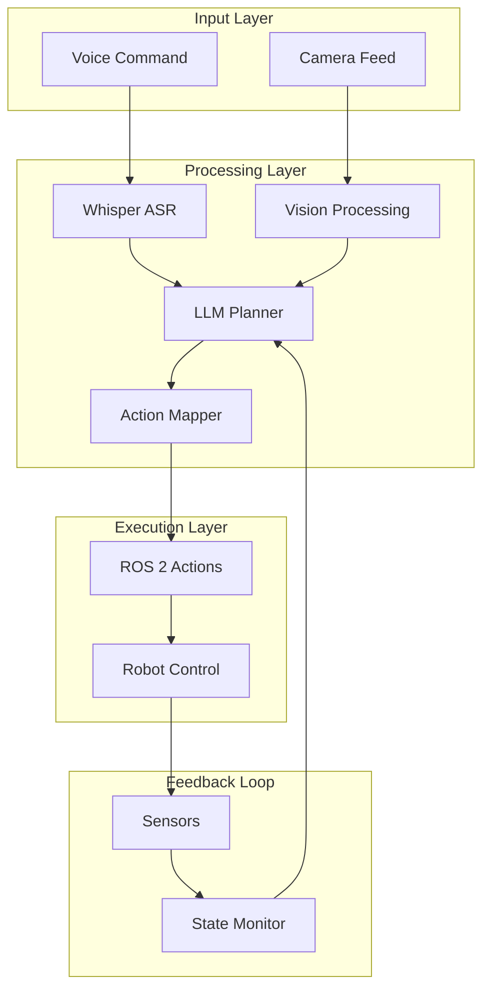

# Vision-Language-Action (VLA) Systems - Refined Educational Content

## Table of Contents
1. [Core VLA Concepts](#core-vla-concepts)
2. [System Architecture](#system-architecture)
3. [Implementation Guide](#implementation-guide)
4. [Learning Path](#learning-path)
5. [Best Practices](#best-practices)

## Core VLA Concepts

### What is Vision-Language-Action (VLA)?

Vision-Language-Action (VLA) represents a paradigm shift in robotics, where robots can understand natural language commands, perceive their environment through visual sensors, and execute appropriate physical actions. This integration enables more intuitive human-robot interaction and sophisticated autonomous behaviors.

#### Key Characteristics:
- **Multimodal Integration**: Combines vision, language, and action processing
- **Embodied Reasoning**: Connects perception to action in physical environments
- **Natural Interaction**: Enables communication through everyday language
- **Adaptive Behavior**: Responds to environmental changes and user needs

### The Three Pillars of VLA

#### 1. Vision Processing
Vision processing enables robots to understand their environment through cameras and other visual sensors:

- **Object Detection**: Identifying and locating objects in the environment
- **Scene Understanding**: Interpreting spatial relationships and context
- **Visual Tracking**: Following objects or features over time
- **Depth Perception**: Understanding 3D spatial relationships

#### 2. Language Understanding
Language understanding enables robots to interpret natural language commands:

- **Speech Recognition**: Converting spoken language to text
- **Natural Language Processing**: Understanding meaning and intent
- **Command Interpretation**: Mapping language to actionable tasks
- **Context Awareness**: Understanding commands in environmental context

#### 3. Action Generation
Action generation translates high-level goals into low-level motor commands:

- **Task Planning**: Decomposing complex goals into executable steps
- **Motion Planning**: Determining safe and efficient movement paths
- **Motor Control**: Executing precise physical movements
- **Feedback Processing**: Monitoring results and adjusting behavior

### Multimodal Integration

The power of VLA systems comes from combining information from different sensory modalities:

```
┌─────────────┐    ┌─────────────┐    ┌─────────────┐
│   Vision    │    │  Language   │    │   Action    │
│             │    │             │    │             │
│ • Objects   │    │ • Commands  │    │ • Plans     │
│ • Scenes    │    │ • Intent    │    │ • Execution │
│ • Spatial   │    │ • Context   │    │ • Feedback  │
└─────────────┘    └─────────────┘    └─────────────┘
        │                   │                   │
        └───────────────────┼───────────────────┘
                            ▼
                    ┌─────────────┐
                    │ Integration │
                    │   Engine    │
                    │             │
                    │ • Reasoning │
                    │ • Planning  │
                    │ • Execution │
                    └─────────────┘
```

## System Architecture

### High-Level Architecture



### Detailed Data Flow

```
Voice Command: "Go to kitchen and find red cup"
                    ↓
         ┌─────────────────────────┐
         │ 1. Speech Recognition │
         │    → "Go to kitchen   │
         │       and find red cup"│
         └─────────────────────────┘
                    ↓
         ┌─────────────────────────┐
         │ 2. Language Parsing   │
         │    → Action: Navigate │
         │    → Target: kitchen  │
         │    → Action: Find     │
         │    → Target: red cup  │
         └─────────────────────────┘
                    ↓
         ┌─────────────────────────┐
         │ 3. Vision Processing  │
         │    → Locate kitchen   │
         │    → Detect red cup   │
         │    → Map coordinates  │
         └─────────────────────────┘
                    ↓
         ┌─────────────────────────┐
         │ 4. Task Planning      │
         │    → Path to kitchen  │
         │    → Approach cup     │
         │    → Grasp action     │
         └─────────────────────────┘
                    ↓
         ┌─────────────────────────┐
         │ 5. Action Execution   │
         │    → Navigate         │
         │    → Detect & Grasp   │
         │    → Report results   │
         └─────────────────────────┘
```

## Implementation Guide

### Voice-to-Action Pipeline

#### Step 1: Speech Recognition with Whisper
```python
# Example voice processing flow
def process_voice_command(audio_input):
    # Convert speech to text using Whisper
    text_command = whisper_transcribe(audio_input)

    # Validate and preprocess command
    validated_command = preprocess_command(text_command)

    return validated_command
```

#### Step 2: LLM-Based Planning
```python
def plan_task_from_command(command, context):
    # Use LLM to decompose high-level command
    plan = llm.generate_plan(command, context)

    # Validate and optimize plan
    validated_plan = validate_plan(plan)

    return validated_plan
```

#### Step 3: Action Mapping
```python
def map_plan_to_actions(plan):
    # Convert high-level plan to ROS 2 actions
    ros_actions = []
    for task in plan.tasks:
        action = action_mapper.map_task_to_ros_action(task)
        ros_actions.append(action)

    return ros_actions
```

### Vision Processing Pipeline

#### Object Detection and Scene Understanding
```python
def process_vision_input(image):
    # Detect objects in the scene
    detections = object_detector.detect(image)

    # Analyze spatial relationships
    relationships = spatial_analyzer.analyze(detections)

    # Create action context
    context = create_action_context(detections, relationships)

    return context
```

### Integration Patterns

#### The VLA Orchestrator Pattern
```python
class VLASystem:
    def __init__(self):
        self.language_processor = LanguageProcessor()
        self.vision_processor = VisionProcessor()
        self.planner = TaskPlanner()
        self.action_executor = ActionExecutor()

    def execute_command(self, command, context=None):
        # Process language
        language_result = self.language_processor.process(command)

        # Process vision (if needed)
        vision_result = self.vision_processor.process(context)

        # Plan task
        plan = self.planner.create_plan(
            language_result,
            vision_result
        )

        # Execute actions
        execution_result = self.action_executor.execute(plan)

        return execution_result
```

## Learning Path

### Module 1: Understanding VLA Concepts
- Study multimodal integration principles
- Learn about embodied AI and reasoning
- Understand the relationship between perception and action

### Module 2: Voice Processing Implementation
- Implement Whisper-based speech recognition
- Process and validate voice commands
- Handle speech recognition errors and confidence

### Module 3: LLM-Based Planning
- Design prompt engineering strategies
- Implement task decomposition algorithms
- Create planning validation systems

### Module 4: Action Mapping and Execution
- Map plans to ROS 2 actions
- Implement action execution monitoring
- Create feedback processing systems

### Module 5: System Integration
- Integrate all components into a cohesive system
- Implement error handling and recovery
- Optimize performance and resource usage

## Best Practices

### Design Principles

#### 1. Robustness First
- Always have fallback behaviors
- Validate inputs before processing
- Implement graceful degradation

#### 2. Safety by Design
- Validate all actions before execution
- Implement safety checks and limits
- Monitor system state continuously

#### 3. Performance Optimization
- Minimize processing latency
- Optimize resource usage
- Implement caching where appropriate

### Implementation Guidelines

#### Error Handling
```python
# Example error handling pattern
def safe_process_command(command):
    try:
        # Validate input
        if not validate_command(command):
            raise ValueError("Invalid command format")

        # Process command
        result = process_vla_pipeline(command)

        # Validate result
        if not validate_result(result):
            raise RuntimeError("Invalid result from pipeline")

        return result

    except Exception as e:
        # Log error with context
        logger.error(f"Command processing failed: {e}",
                    extra={"command": command})

        # Return safe fallback
        return create_fallback_response(command)
```

#### Performance Monitoring
```python
# Example performance tracking
def monitor_performance(func):
    def wrapper(*args, **kwargs):
        start_time = time.time()
        try:
            result = func(*args, **kwargs)
            execution_time = time.time() - start_time

            # Log performance metrics
            metrics.record_execution_time(execution_time)
            metrics.increment_success_count()

            return result
        except Exception as e:
            execution_time = time.time() - start_time
            metrics.record_execution_time(execution_time)
            metrics.increment_error_count()
            raise
    return wrapper
```

### Common Pitfalls to Avoid

1. **Over-reliance on Perfect Conditions**: Design for real-world scenarios with noise, occlusions, and ambiguity

2. **Ignoring Feedback Loops**: Always incorporate sensor feedback to verify action success

3. **Insufficient Error Handling**: Plan for failures at every stage of the pipeline

4. **Performance Neglect**: Monitor and optimize for real-time constraints

5. **Safety Oversights**: Always validate actions before execution in simulation

## Assessment Preparation

### Key Concepts to Master

#### Theoretical Understanding
- Multimodal integration principles
- Embodied reasoning concepts
- Vision-language alignment
- Action planning algorithms

#### Practical Skills
- Voice command processing
- LLM prompt engineering
- ROS 2 action integration
- System debugging and monitoring

#### Problem-Solving
- Handling ambiguous commands
- Managing system failures
- Optimizing performance trade-offs

### Sample Scenarios for Practice

1. **Navigation Task**: "Go to the kitchen and bring me the red cup"
2. **Search Task**: "Find all blue objects in the room"
3. **Complex Task**: "Move the book from the table to the shelf"
4. **Error Recovery**: Handling cases where objects aren't found

## Resources and Further Learning

### Recommended Reading
- "Multimodal Machine Learning" by Baltrusaitis et al.
- "Embodied AI" research papers
- ROS 2 documentation for action interfaces
- Whisper and LLM technical papers

### Tools and Libraries
- OpenAI Whisper for speech recognition
- Hugging Face Transformers for LLM integration
- OpenCV for computer vision
- ROS 2 for robotics integration

---

This refined educational content provides a comprehensive understanding of Vision-Language-Action systems, from fundamental concepts to practical implementation. Students should focus on understanding the integration patterns and best practices to build robust VLA systems for humanoid robots.