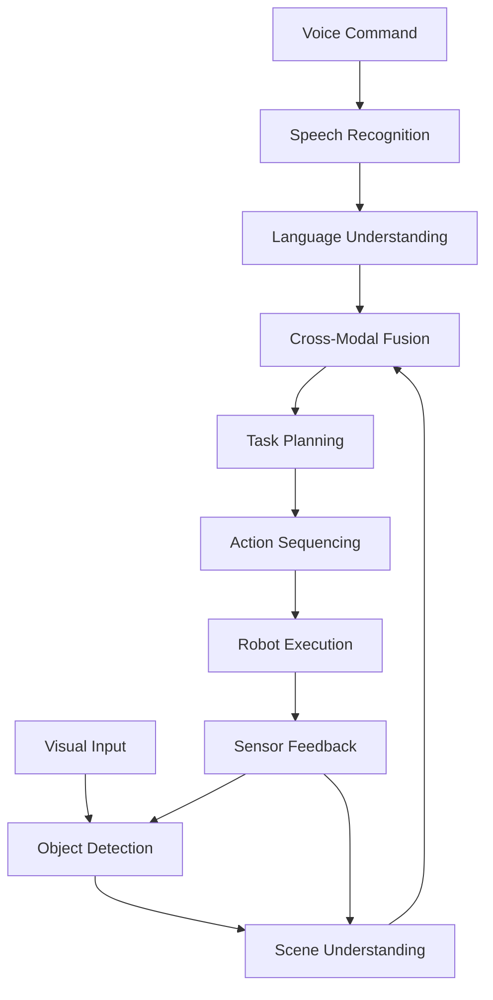
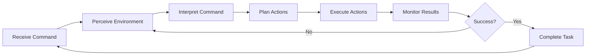
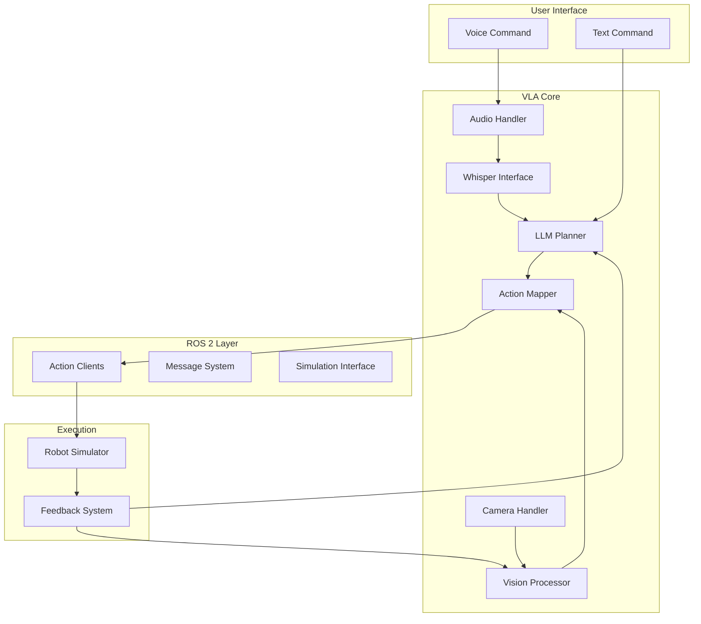
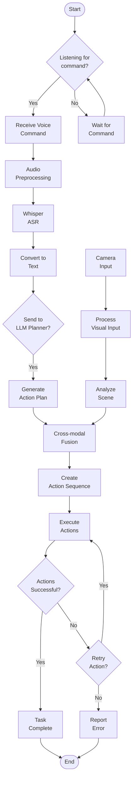

# VLA Visual Aids and Diagrams

## 1. High-Level VLA Architecture

```
┌─────────────────┐    ┌──────────────────┐    ┌─────────────────┐
│   Human User    │    │   VLA System     │    │  Robot Actions  │
│                 │    │                  │    │                 │
│  "Bring me     │───▶│  ┌─────────────┐ │    │ ┌─────────────┐ │
│  the red cup"   │    │  │ Language    │ │───▶│ │ Action      │ │
│                 │    │  │ Processing  │ │    │ │ Execution   │ │
│                 │    │  └─────────────┘ │    │ └─────────────┘ │
└─────────────────┘    │  ┌─────────────┐ │    │                 │
                       │  │ Vision      │ │───▶│                 │
                       │  │ Processing  │ │    │                 │
                       │  └─────────────┘ │    │                 │
                       └──────────────────┘    └─────────────────┘
```

## 2. Detailed VLA Pipeline



## 3. Component Interaction Flow

```
┌─────────────────┐
│  Input Layer    │
├─────────────────┤
│ • Voice Input   │
│ • Camera Input  │
└─────────────────┘
         │
         ▼
┌─────────────────┐
│ Processing Layer│
├─────────────────┤
│ • ASR (Whisper) │
│ • NLP (LLM)     │
│ • Vision Model  │
└─────────────────┘
         │
         ▼
┌─────────────────┐
│  Planning Layer │
├─────────────────┤
│ • Task Planner  │
│ • Action Mapper │
└─────────────────┘
         │
         ▼
┌─────────────────┐
│ Execution Layer │
├─────────────────┤
│ • ROS 2 Actions │
│ • Robot Control │
└─────────────────┘
```

## 4. VLA System Data Flow

```
┌─────────────┐    ┌─────────────┐    ┌─────────────┐
│   Command   │───▶│  Processed  │───▶│   Action    │
│   Input     │    │   Input     │    │   Output    │
│             │    │             │    │             │
│ • Natural   │    │ • Parsed    │    │ • Action    │
│   Language  │    │   Intent    │    │   Sequence  │
│ • Context   │    │ • Detected  │    │ • Execution │
│   Objects   │    │   Objects   │    │   Plan      │
└─────────────┘    └─────────────┘    └─────────────┘
```

## 5. Multimodal Integration

```
Vision ──┐
         ├───► Fusion ───► Action
Language ──┘
    │
    └─── Context Awareness
```

## 6. VLA Execution Cycle



## 7. Educational Learning Path

```
┌─────────────────┐
│  VLA Concepts   │
└─────────┬───────┘
          │
          ▼
┌─────────────────┐
│ Vision Systems  │
└─────────┬───────┘
          │
          ▼
┌─────────────────┐
│ Language Models │
└─────────┬───────┘
          │
          ▼
┌─────────────────┐
│ Action Planning │
└─────────┬───────┘
          │
          ▼
┌─────────────────┐
│ Integration &   │
│ Implementation  │
└─────────────────┘
```

## 8. Key Technologies Stack

```
┌─────────────────────────────────────┐
│           Application Layer         │
├─────────────────────────────────────┤
│        VLA Command Interface        │
├─────────────────────────────────────┤
│          Planning Layer             │
│    • Task Decomposition             │
│    • Action Sequencing              │
├─────────────────────────────────────┤
│         Processing Layer            │
│    • Whisper (ASR)                  │
│    • LLM (NLP)                      │
│    • Vision Models                  │
├─────────────────────────────────────┤
│         ROS 2 Interface             │
│    • Action Clients/Servers         │
│    • Message Definitions            │
├─────────────────────────────────────┤
│         Simulation Layer            │
│    • Gazebo Environment             │
│    • Robot Models                   │
└─────────────────────────────────────┘
```

## 9. System Architecture Overview

This diagram shows how all components work together in the VLA system:



## 10. Workflow Visualization

The following flowchart illustrates the complete VLA workflow:

