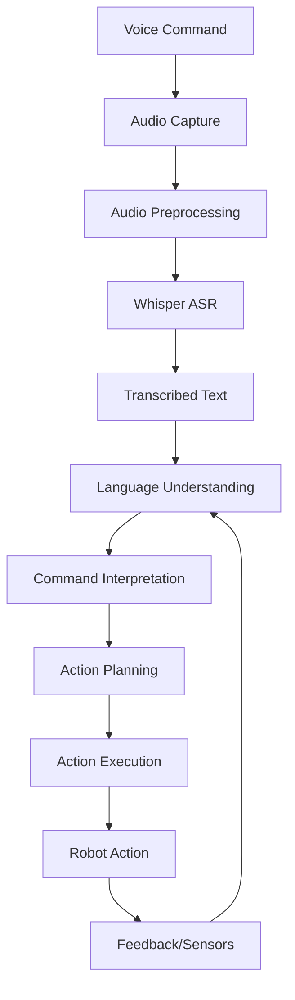
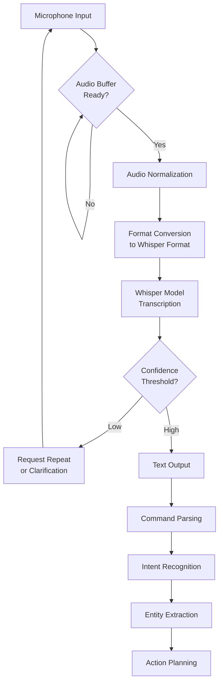
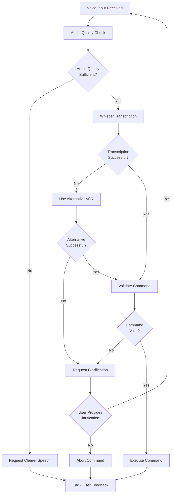
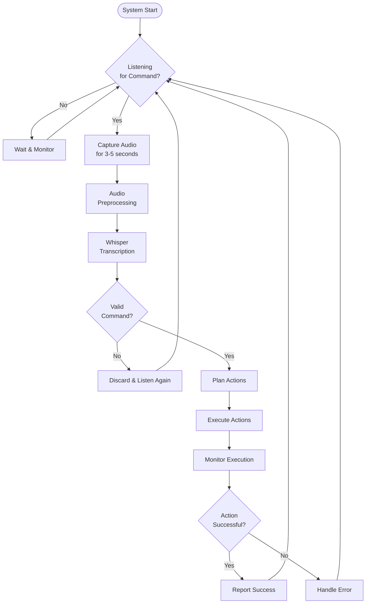
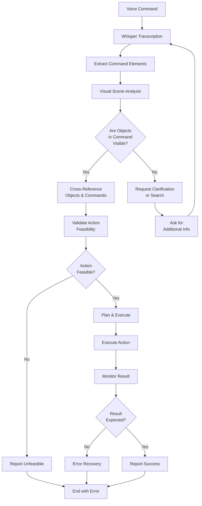
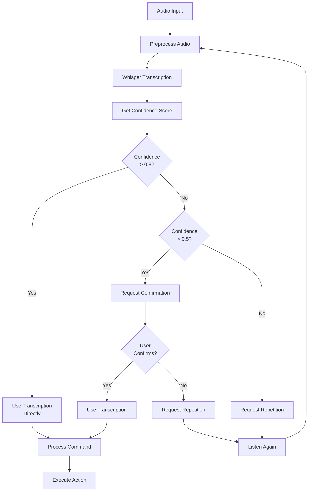
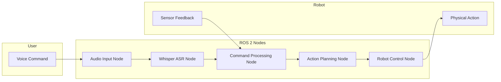
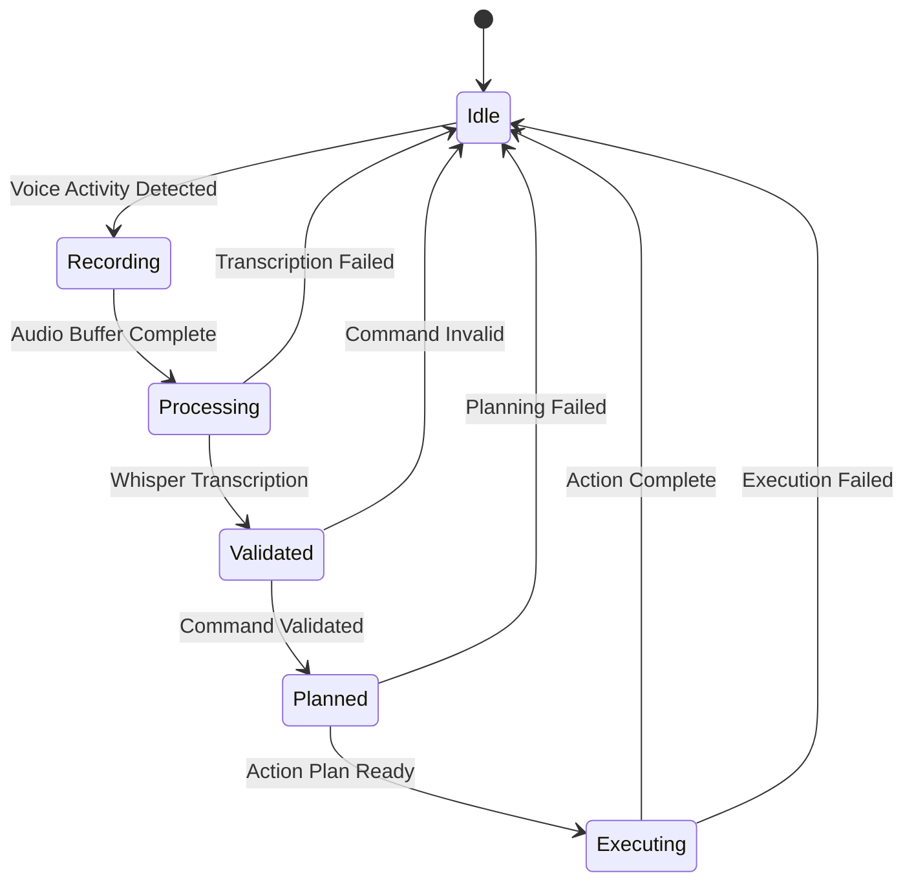
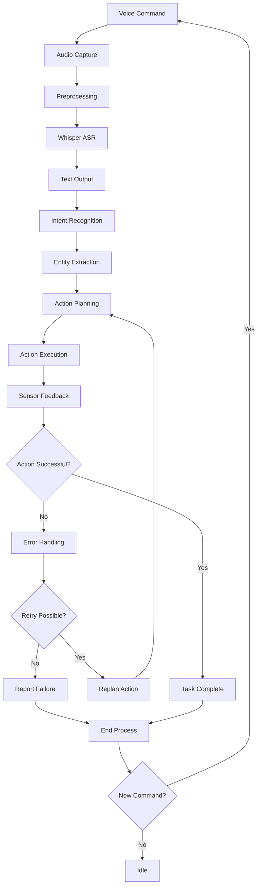

# Voice-to-Action Pipeline Flowcharts

## 1. High-Level Voice-to-Action Flow



## 2. Detailed Whisper Integration Flow



## 3. Error Handling Flow



## 4. Real-time Voice Processing Loop



## 5. Multi-Modal Validation Flow



## 6. Confidence-Based Processing Flow



## 7. Pipeline Integration with ROS 2



## 8. Voice Command Processing State Machine



## 9. Component Interaction Flow

```
┌─────────────────┐    ┌─────────────────┐    ┌─────────────────┐
│   Microphone    │───▶│ Audio Handler   │───▶│ Whisper Node    │
│                 │    │                 │    │                 │
│ Captures voice  │    │ Preprocesses    │    │ Transcribes     │
│ commands        │    │ audio for       │    │ audio to text   │
└─────────────────┘    │ Whisper         │    └─────────────────┘
                       │ requirements    │              │
                       └─────────────────┘              ▼
                                                      ┌─────────────────┐
                                                      │ Command Parser  │
                                                      │                 │
                                                      │ Interprets text │
                                                      │ command         │
                                                      └─────────────────┘
                                                                      │
                                                                      ▼
                        ┌─────────────────┐              ┌─────────────────┐
                        │ Action Planner  │<─────────────│ LLM Interpreter │
                        │                 │              │                 │
                        │ Plans robot     │              │ Determines      │
                        │ actions         │              │ action sequence │
                        └─────────────────┘              └─────────────────┘
                              │
                              ▼
                        ┌─────────────────┐
                        │ Robot Executor  │
                        │                 │
                        │ Executes planned│
                        │ actions         │
                        └─────────────────┘
```

## 10. Processing Pipeline with Feedback



These flowcharts illustrate the complete voice-to-action pipeline in VLA systems, showing how voice commands are processed through Whisper ASR and transformed into robot actions, with appropriate error handling and feedback mechanisms.