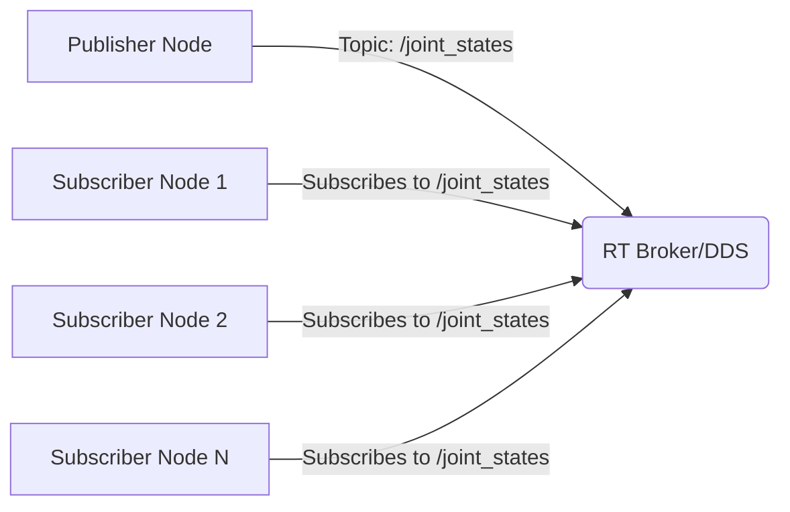
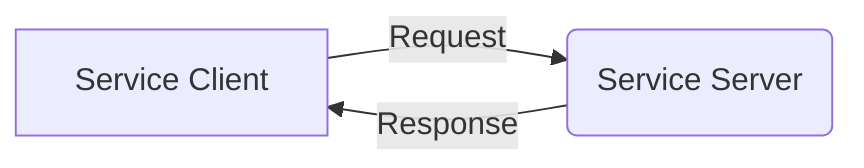
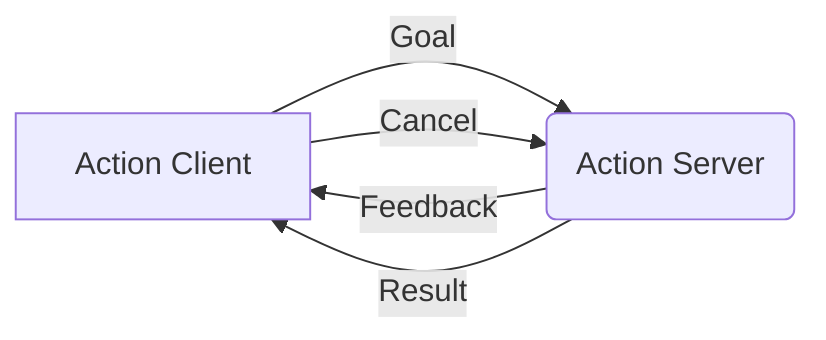
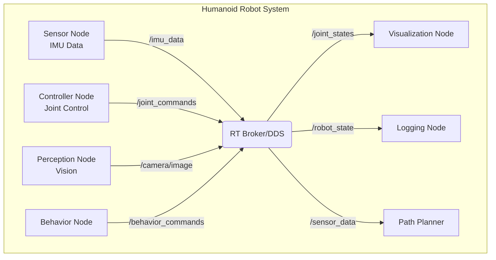

# ROS 2 Basics: Nodes, Topics, Services, and Actions

## Learning Objectives
By the end of this section, you will be able to:
- Explain the core concepts of ROS 2: nodes, topics, services, and actions
- Understand how these concepts enable robot communication
- Identify the appropriate communication pattern for different scenarios
- Apply these concepts in the context of humanoid robotics

## Introduction to ROS 2 Concepts

ROS 2 (Robot Operating System 2) is not actually an operating system, but rather a middleware framework that enables different components of a robot to communicate with each other. Think of it as the "nervous system" of a robot, where different parts need to send and receive information to work together effectively.

Just as your biological nervous system allows your brain to communicate with your limbs, ROS 2 allows different software components (nodes) to communicate with each other through various patterns.

## The Core Building Blocks

### Nodes
A **node** is a process that performs computation. In ROS 2, nodes are the basic unit of computation. Each node can perform specific tasks and communicate with other nodes. In humanoid robotics, you might have nodes for:

- Joint controllers
- Sensor processing
- Path planning
- Behavior management

Nodes are designed to be modular, so if one component fails, it doesn't necessarily bring down the entire robot system.

### Topics and Publish/Subscribe Pattern
**Topics** enable the publish/subscribe communication pattern in ROS 2. This is an asynchronous, many-to-many communication method where:

- Publishers send messages to a topic
- Subscribers receive messages from a topic
- Multiple publishers and subscribers can use the same topic
- Communication is decoupled in time (no need for both nodes to be active simultaneously)

**Humanoid Example**: A sensor node might publish joint position data to the "joint_states" topic, and multiple other nodes (like controllers, visualizers, and loggers) can subscribe to this topic to receive the information.

### Services
**Services** enable synchronous request/response communication. This is a one-to-one communication pattern where:

- A client sends a request to a server
- The server processes the request and sends back a response
- The client waits for the response before continuing
- Communication is synchronous (blocking)

**Humanoid Example**: A high-level planner might use a service to request a specific joint angle from a controller, waiting for confirmation before proceeding.

### Actions
**Actions** are for long-running tasks that require feedback and the ability to cancel. They combine features of topics and services:

- Goal: Request to perform a task
- Feedback: Continuous updates on progress
- Result: Final outcome when the task completes

**Humanoid Example**: Moving an arm to a specific position might be implemented as an action, providing feedback on progress and allowing cancellation if an obstacle is detected.

## Deep Dive: Nodes

Nodes are the fundamental building blocks of any ROS 2 system. Here's what you need to know:

### Node Characteristics
- Each node runs in its own process
- Nodes can be written in different programming languages (Python, C++, etc.)
- Nodes communicate through topics, services, and actions
- Nodes can have parameters for configuration

### Creating a Node
When you create a node, you typically:
1. Initialize the ROS 2 client library
2. Create the node with a unique name
3. Define publishers, subscribers, services, or actions
4. Implement the main logic
5. Spin the node to process callbacks

## Deep Dive: Topics

Topics implement the publish/subscribe pattern, which is ideal for continuous data streams.

### Key Features
- **Asynchronous**: Publishers and subscribers don't need to be synchronized
- **Many-to-many**: Multiple publishers can send to the same topic; multiple subscribers can receive from it
- **Data-driven**: Communication is based on data availability rather than specific requests

### Quality of Service (QoS)
ROS 2 provides QoS settings to control how messages are delivered:
- Reliability: Best effort vs. reliable delivery
- Durability: Volatile vs. transient local (for late-joining subscribers)
- History: Keep all messages vs. keep last N messages

## Deep Dive: Services

Services are ideal for request/response interactions.

### When to Use Services
- When you need guaranteed delivery and response
- For configuration or one-time requests
- When the client needs to wait for a result

### Service Characteristics
- Synchronous communication
- One client, one server at a time
- Request/response message types are predefined

## Deep Dive: Actions

Actions are designed for long-running operations.

### Action Components
1. **Goal**: What the client wants the server to do
2. **Feedback**: Updates on progress during execution
3. **Result**: Final outcome when the action completes

### When to Use Actions
- Moving to a specific location
- Performing a complex manipulation task
- Any task that takes time and might need cancellation

## Humanoid Robotics Context

In humanoid robotics, these concepts come together in sophisticated ways:

- **Sensor Nodes**: Publish data about joint positions, IMU readings, camera feeds
- **Controller Nodes**: Subscribe to sensor data and publish motor commands
- **Behavior Nodes**: Use services for configuration and actions for complex tasks
- **Visualization Nodes**: Subscribe to multiple data streams for monitoring

## Chapter Summary

ROS 2 provides three main communication patterns:
1. **Topics** for continuous data streams (publish/subscribe)
2. **Services** for request/response interactions
3. **Actions** for long-running tasks with feedback

Each pattern serves different needs in robot systems, and humanoid robots typically use all three in combination to achieve complex behaviors.

## Exercises

1. Identify which communication pattern would be most appropriate for:
   - Publishing camera images from a robot's head
   - Requesting the robot to move its arm to a specific position
   - Getting the current battery level
   - Sending feedback about walking progress

2. Explain why the publish/subscribe pattern is well-suited for sensor data in humanoid robots.

3. Describe a scenario where an action would be more appropriate than a service in humanoid robotics.

---

## Diagrams: ROS 2 Communication Patterns

### Publish/Subscribe Pattern

### Service Pattern

### Action Pattern

### Humanoid Robot Example

## Navigation
- **Previous**: [Introduction](introduction.md)
- **Next**: [DDS Overview](dds_overview.md)