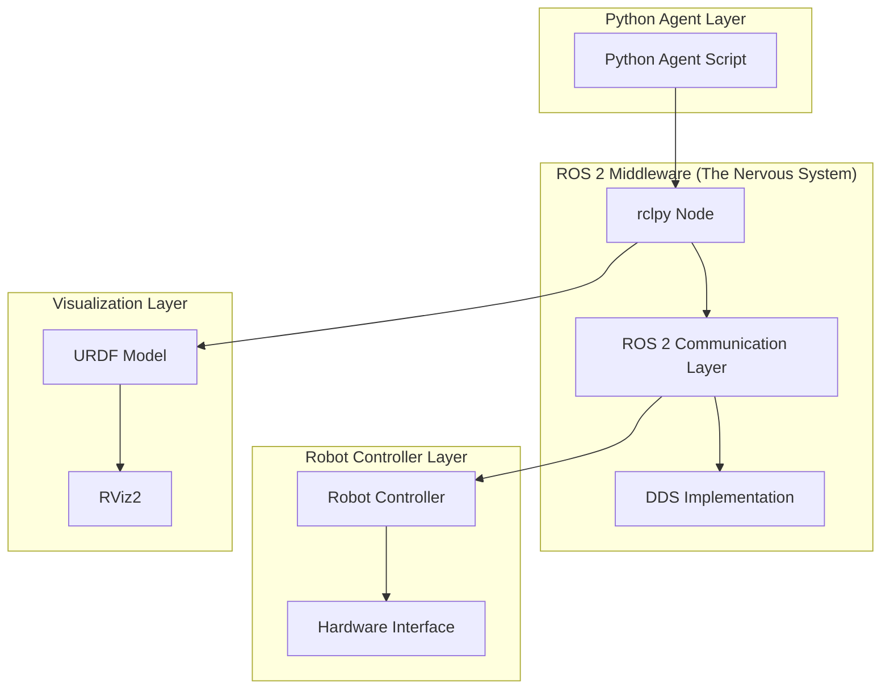
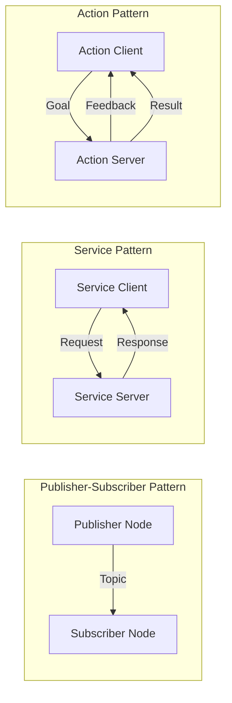
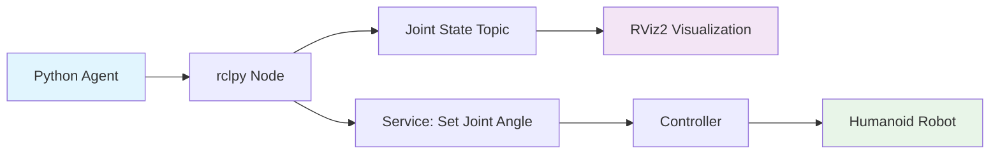

# Research: ROS 2 Fundamentals Module

## Architecture Sketch

### High-Level Architecture

### ROS 2 Communication Patterns

### Humanoid Data Flow

## Section Structure

### 1. Introduction: Why ROS 2 is the robotic nervous system
- Explain middleware concept with biological nervous system analogy
- Highlight decoupling of components
- Introduce humanoid robot context

### 2. ROS 2 Basics: Nodes, Topics, Services
- What is a Node? (process with computation)
- What is a Topic? (publish/subscribe communication)
- What is a Service? (request/response communication)

### 3. DDS Overview (simple explanation, tied to humanoid robots)
- What is DDS? (Data Distribution Service)
- How it enables decoupled communication
- Real-time capabilities for robot control

### 4. Creating a ROS 2 Workspace
- Setting up colcon workspace
- Directory structure
- Environment setup

### 5. Building a ROS 2 Python Package (rclpy)
- Package structure (package.xml, setup.py)
- ament_python conventions
- Node creation workflow

### 6. Publisher/Subscriber Examples (humanoid joint angles, IMU data)
- Joint state publisher (sensor_msgs/JointState)
- IMU data subscriber (sensor_msgs/Imu)
- Launch file for coordination

### 7. Service Example (e.g., "set_joint_angle")
- Service definition
- Server implementation
- Client implementation

### 8. How Python Agents Communicate with ROS Controllers
- Python script → rclpy node → ROS network → controllers
- Bridge concept explanation

### 9. URDF for Humanoids: Links, Joints, Visual
- XML structure for robot description
- Visual-only elements (no inertial/collision for simplicity)
- Link and joint definitions

### 10. Loading & Testing URDF in RViz2
- Launching RViz2
- Loading URDF file
- Verifying visualization

### 11. Hands-on Exercises
- Complete example projects
- Step-by-step validation

### 12. Summary Checklist
- Knowledge verification
- Skill assessment

## Development Approach

### Build-While-Writing Strategy
1. Generate content incrementally
2. Validate each code block before moving forward
3. Maintain humanoid context consistency
4. Ensure Docusaurus-ready Markdown
5. Base on ROS 2 Humble + Ubuntu 22.04

## Decisions Needing Documentation

### 1. Python vs C++
**Options:**
- Python (rclpy) - readability and simplicity
- C++ (rclcpp) - performance and industry standard

**Final Choice:** Python (rclpy)
**Rationale:** For educational purposes, Python offers better readability and faster learning curve for beginners. The rclpy library provides all necessary functionality for learning ROS 2 concepts.

### 2. URDF Complexity Level
**Options:**
- Minimal humanoid structure (visual elements only)
- Realistic model (visual, inertial, collision, transmission)

**Final Choice:** Minimal humanoid structure (visual elements only)
**Rationale:** For Module 1, focusing on visual elements keeps complexity manageable while still demonstrating core URDF concepts. Inertial and collision properties can be introduced in later modules.

### 3. Message Types
**Options:**
- Standard messages (std_msgs, sensor_msgs, geometry_msgs)
- Custom humanoid messages

**Final Choice:** Standard messages (std_msgs, sensor_msgs, geometry_msgs)
**Rationale:** Using standard message types aligns with ROS 2 ecosystem and provides consistency with official documentation and community examples.

### 4. Teaching Order
**Options:**
- URDF first, then nodes
- Nodes first, then URDF
- Parallel introduction

**Final Choice:** Nodes first, then URDF
**Rationale:** Understanding communication patterns (nodes, topics, services) provides foundational knowledge needed to appreciate how URDF models integrate with the ROS 2 system.

### 5. Level of detail in DDS explanation
**Options:**
- High-level only (conceptual)
- Deeper exploration (technical details)

**Final Choice:** High-level only (conceptual)
**Rationale:** For beginners, understanding DDS as an implementation of the publish/subscribe pattern is sufficient. Detailed technical exploration can be deferred to advanced modules.

## Quality Validation Strategy

### Technical Validation
- Every code example runs on ROS 2 Humble
- Nodes communicate correctly (publisher/subscriber/service)
- URDF file loads without errors in RViz2
- All Bash commands work in a fresh workspace

### Documentation Validation
- Clear explanations with no ambiguous language
- Correct file paths and Docusaurus Markdown formatting
- Diagrams render properly

### Learning Validation
- Student understands ROS 2 communication
- Student builds simple humanoid URDF
- Student connects Python agent to ROS nodes
- Student runs all examples end-to-end

## Testing Strategy

### Based on Module 1 Acceptance Criteria:
- Build workspace with `colcon build`
- Run nodes independently and together
- Use `ros2 topic echo`, `ros2 topic list`, `ros2 service call` to test communication
- Load URDF in RViz2 and verify visual elements
- Verify correct folder structures (package.xml, setup.py, etc.)