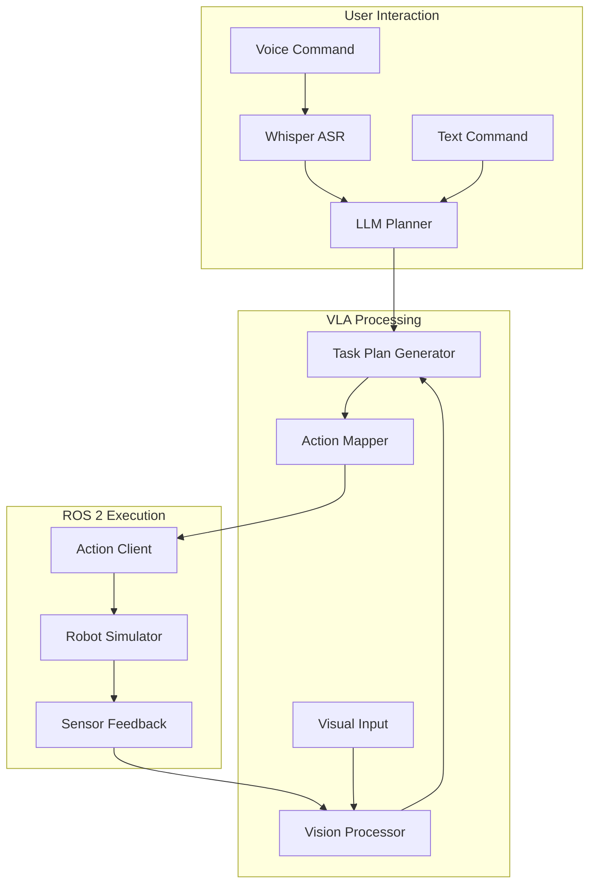
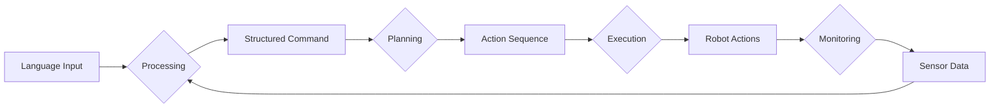

# Module 4: Vision-Language-Action (VLA) - Implementation Plan

## Objective
Explain how language, vision, and reasoning enable humanoid robots to plan and execute actions.

## Overview
This plan outlines the implementation of educational materials for Module 4, focusing on Vision-Language-Action systems in robotics. The module will teach students how to integrate language understanding, visual perception, and action execution in humanoid robots.

## 1. Introduction to Vision-Language-Action in Physical AI

### 1.1 Learning Objectives
- Understand the concept of Vision-Language-Action (VLA) in robotics
- Recognize the importance of multimodal integration in embodied AI
- Learn how VLA models bridge the gap between perception and action

### 1.2 Content Structure
- Definition and significance of VLA in robotics
- Historical context and evolution of VLA systems
- Comparison with traditional robotics approaches
- Current state-of-the-art VLA models

### 1.3 Deliverables
- Educational content explaining VLA concepts
- Interactive examples demonstrating VLA capabilities
- Visual aids and diagrams

## 2. Voice-to-Text Pipeline Using Whisper (Conceptual)

### 2.1 Learning Objectives
- Understand the role of speech recognition in VLA systems
- Learn about Whisper architecture and capabilities
- Implement conceptual understanding of voice-to-action pipelines

### 2.2 Implementation Steps
1. Overview of speech recognition in robotics
2. Introduction to OpenAI's Whisper model
3. Audio preprocessing for robotic applications
4. Integration with language understanding modules
5. Error handling and confidence scoring

### 2.3 Constraints
- Focus on conceptual understanding rather than implementation details
- Simulation-only environment
- No model training required

### 2.4 Deliverables
- Conceptual explanation of Whisper integration
- Flowchart of voice-to-action pipeline
- Discussion of limitations and considerations

## 3. LLM-Based Task Planning and Decomposition

### 3.1 Learning Objectives
- Understand how Large Language Models can generate executable plans
- Learn task decomposition techniques for robotic actions
- Explore reasoning capabilities in robotic planning

### 3.2 Implementation Steps
1. Introduction to LLMs for robotic planning
2. Prompt engineering for task planning
3. Techniques for plan validation and safety checks
4. Handling of ambiguous or impossible requests
5. Integration with action execution systems

### 3.3 Key Concepts
- Chain-of-thought reasoning
- Hierarchical task networks
- Plan refinement and error recovery
- Context maintenance

### 3.4 Deliverables
- Explanation of LLM-based planning approaches
- Examples of task decomposition
- Safety considerations and validation methods

## 4. Vision Grounding for Decision Making

### 4.1 Learning Objectives
- Understand how visual information guides robotic actions
- Learn about object detection and scene understanding
- Explore attention mechanisms in VLA systems

### 4.2 Implementation Steps
1. Introduction to computer vision in robotics
2. Object detection and recognition techniques
3. Scene understanding and spatial reasoning
4. Integration of visual and linguistic information
5. Grounding language commands in visual context

### 4.3 Key Technologies
- Vision-language models
- Attention mechanisms
- Spatial reasoning algorithms
- Multimodal fusion techniques

### 4.4 Deliverables
- Overview of vision grounding concepts
- Examples of visual-linguistic integration
- Discussion of real-world applications

## 5. Mapping Plans to ROS 2 Actions

### 5.1 Learning Objectives
- Understand how high-level plans translate to low-level robot actions
- Learn ROS 2 action architecture and interfaces
- Explore the connection between symbolic planning and motor control

### 5.2 Implementation Steps
1. Overview of ROS 2 action architecture
2. Design of action interfaces for VLA systems
3. Mapping abstract plans to concrete actions
4. Feedback integration and plan adjustment
5. Error handling and recovery strategies

### 5.3 ROS 2 Components
- Action clients and servers
- Message definitions
- Service interfaces
- Parameter management

### 5.4 Deliverables
- Explanation of ROS 2 action mapping
- Examples of plan-to-action translation
- Code snippets for action implementation

## 6. End-to-End VLA Flow Walkthrough

### 6.1 Learning Objectives
- Understand the complete pipeline from language command to robot action
- Learn about system integration challenges
- Explore debugging and evaluation techniques

### 6.2 Implementation Steps
1. System architecture overview
2. Component interaction flow
3. Data flow visualization
4. Error propagation and handling
5. Performance considerations

### 6.3 Integration Points
- Language understanding to planning
- Planning to action execution
- Action execution to perception feedback
- Continuous loop operation

### 6.4 Deliverables
- Complete system walkthrough
- Integration guide
- Troubleshooting resources

## 7. Educational Materials and Examples

### 7.1 Content Format
- Docusaurus Markdown pages for documentation
- Interactive examples where possible
- Code snippets and explanations
- Visual aids and diagrams

### 7.2 Example Scenarios
- Simple command execution (e.g., "Pick up the red ball")
- Complex task sequences (e.g., "Go to the kitchen and bring me water")
- Error handling scenarios (e.g., when objects are not found)

### 7.3 Simulation Environment
- Use existing ROS 2 simulation tools
- Integration with Gazebo or similar environments
- Visualization of VLA pipeline execution

## 8. Technical Implementation

### 8.1 Architecture Diagram

### 8.2 Data Flow Diagram

### 8.3 Component Interface Specifications
- ASR module: Accepts audio, outputs transcribed text
- LLM planner: Accepts command text, outputs task plan
- Vision processor: Accepts image data, outputs scene understanding
- Action mapper: Accepts task plan, outputs ROS 2 action calls

## 9. Testing and Validation

### 9.1 Unit Testing
- Individual component validation
- Mock interfaces for isolated testing
- Edge case handling

### 9.2 Integration Testing
- Complete pipeline validation
- Scenario-based testing
- Performance benchmarking

### 9.3 Educational Validation
- Student comprehension assessment
- Exercise effectiveness evaluation
- Feedback incorporation mechanism

## 10. Constraints Compliance

### 10.1 Simulation-Only Implementation
- No hardware dependencies
- Full functionality in simulated environment
- Realistic simulation parameters

### 10.2 No Model Training
- Use pre-trained models only
- Focus on integration and application
- Emphasis on conceptual understanding

### 10.3 Concept and Architecture Focus
- Prioritize understanding over implementation details
- Clear architectural diagrams and explanations
- Emphasis on system design principles

## 11. Timeline and Milestones

### Phase 1: Foundation (Week 1)
- VLA concept explanation
- Architecture overview
- Basic diagrams and visual aids

### Phase 2: Components (Week 2)
- Individual component explanations
- Voice-to-text pipeline
- LLM planning integration

### Phase 3: Integration (Week 3)
- Vision grounding implementation
- ROS 2 action mapping
- End-to-end flow

### Phase 4: Validation (Week 4)
- Complete system walkthrough
- Educational material review
- Final adjustments and polish

## 12. Risk Mitigation

### 12.1 Technical Risks
- Complexity of VLA systems: Focus on conceptual understanding
- Dependency on external models: Ensure availability of alternatives
- Integration challenges: Emphasize modular design

### 12.2 Educational Risks
- Student comprehension: Include progressive examples
- Prerequisite knowledge gaps: Provide supplementary materials
- Engagement: Use interactive elements and real-world examples

## 13. Success Metrics

### 13.1 Educational Outcomes
- Student ability to explain VLA concepts
- Understanding of system integration
- Capability to design similar systems

### 13.2 Technical Outcomes
- Functional simulation environment
- Clear architectural documentation
- Reusable educational materials