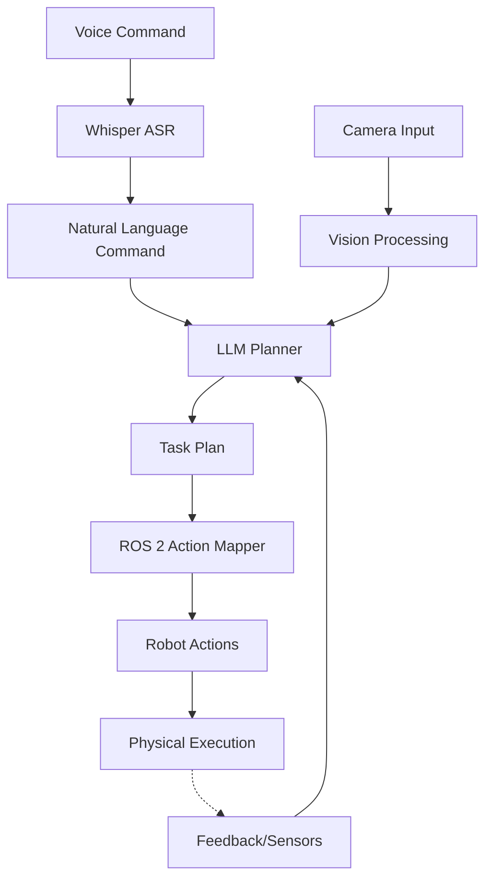

# Module 4: Vision-Language-Action (VLA)

## Goal
Teach how humanoid robots use language, vision, and reasoning to perform actions.

## Scope
- Vision-Language-Action (VLA) concepts
- Voice-to-action using Whisper
- LLM-based task planning
- Mapping plans to ROS 2 actions

## Success Criteria
- Explain VLA in Physical AI
- Show speech → reasoning → ROS 2 actions
- Prepare for autonomous humanoid capstone

## Constraints
- Docusaurus Markdown
- Mermaid diagrams
- Minimal examples
- Simulation-only

## Detailed Specification

### 1. Vision-Language-Action (VLA) Concepts

#### 1.1 Introduction to VLA in Robotics
Vision-Language-Action (VLA) models represent a paradigm shift in robotics, where robots can understand natural language commands, perceive their environment through visual sensors, and execute appropriate physical actions. This integration enables more intuitive human-robot interaction and sophisticated autonomous behaviors.

#### 1.2 VLA Architecture Components
- **Vision Processing**: Image and video understanding for environmental perception
- **Language Understanding**: Natural language processing for command interpretation
- **Action Generation**: Motor control and planning for physical execution
- **Embodied Reasoning**: Integration of perception, cognition, and action

#### 1.3 Applications in Humanoid Robotics
- Domestic assistance (fetching objects, cleaning)
- Industrial collaboration (assembly, inspection)
- Healthcare support (patient assistance, monitoring)
- Educational interactions (tutoring, demonstration)

### 2. Voice-to-Action Implementation Using Whisper

#### 2.1 Speech Recognition Pipeline
```
Voice Input → Whisper ASR → Text → NLP Processing → Action Planning
```

#### 2.2 Whisper Integration
- Real-time speech-to-text conversion
- Noise reduction and audio preprocessing
- Language model fine-tuning for robotic commands
- Confidence scoring and validation

#### 2.3 Voice Command Processing
- Command parsing and validation
- Intent recognition
- Entity extraction (objects, locations, actions)
- Error handling and clarification requests

### 3. LLM-Based Task Planning

#### 3.1 Planning Architecture
- High-level goal decomposition
- Sequential task generation
- Constraint satisfaction
- Resource allocation

#### 3.2 LLM Integration
- Prompt engineering for planning tasks
- Chain-of-thought reasoning
- Memory management for context
- Safety and validation checks

#### 3.3 Planning Strategies
- Hierarchical task networks
- Graph-based planning
- Reactive planning with contingencies
- Multi-step reasoning

### 4. Mapping Plans to ROS 2 Actions

#### 4.1 ROS 2 Action Interface
- Standard action message definitions
- Client-server communication patterns
- Feedback and result handling
- Timeout and cancellation mechanisms

#### 4.2 Plan Execution Pipeline
```
High-level Plan → ROS 2 Action Calls → Robot Execution → Feedback Loop
```

#### 4.3 Action Libraries
- Navigation actions (move_to_pose, follow_path)
- Manipulation actions (pick_object, place_object)
- Sensor actions (take_image, detect_objects)
- Interaction actions (greet_person, speak_text)

### 5. System Architecture Diagram



### 6. Learning Objectives

#### 6.1 Conceptual Understanding
- Students will understand the VLA framework and its importance in embodied AI
- Students will recognize the interplay between vision, language, and action in robotics
- Students will comprehend the challenges and opportunities in VLA systems

#### 6.2 Technical Implementation
- Students will implement voice-to-text processing using Whisper
- Students will design LLM-based planning systems
- Students will map high-level plans to ROS 2 actions
- Students will create integrated VLA pipelines in simulation

#### 6.3 Practical Application
- Students will develop end-to-end VLA systems
- Students will evaluate VLA system performance
- Students will troubleshoot common VLA implementation issues

### 7. Prerequisites
- Basic understanding of ROS 2 concepts
- Familiarity with Python programming
- Knowledge of neural networks and deep learning fundamentals
- Experience with speech recognition concepts

### 8. Assessment Criteria
- Successful implementation of voice-to-action pipeline
- Effective integration of LLM-based planning
- Proper mapping of plans to ROS 2 actions
- Demonstration of complete VLA system in simulation
- Documentation and code quality

### 9. Capstone Preparation
This module prepares students for the autonomous humanoid capstone by:
- Providing essential VLA integration skills
- Building experience with multimodal AI systems
- Developing understanding of embodied AI challenges
- Creating foundation for complex robotic behaviors

## Clarifications

### Session 2025-12-18

- Q: What performance targets should the VLA system achieve? → A: Real-time processing with <5 second response time for voice-to-action
- Q: What LLM model should be used for planning? → A: Use open-source models like Llama 3 or Mistral for educational purposes
- Q: Which Whisper model version should be implemented? → A: Use Whisper large-v3 for optimal speech recognition accuracy
- Q: What simulation environment should be used? → A: Use Gazebo Harmonic with ROS 2 Humble Hawksbill
- Q: Are there security considerations for the VLA system? → A: Focus on educational safety, no sensitive data processing required

### 10. Non-Functional Requirements

#### 10.1 Performance
- Response time: <5 seconds from voice command to action initiation
- Throughput: Handle up to 10 consecutive commands without degradation
- Resource usage: Operate within standard simulation environment constraints

#### 10.2 Security
- Educational focus: No sensitive data processing
- Simulation environment: No external network access required
- Safe operation: All actions validated in simulation before execution

### 11. Technical Specifications

#### 11.1 LLM Selection
- Primary: Llama 3 or Mistral for task planning (open-source, educational-friendly)
- Alternative: OpenAI GPT for comparison demonstrations (API key required)

#### 11.2 Whisper Implementation
- Model: Whisper large-v3 for optimal accuracy
- Preprocessing: Audio normalization and noise reduction
- Confidence threshold: >0.8 for command acceptance

#### 11.3 Simulation Environment
- Primary: Gazebo Harmonic with ROS 2 Humble Hawksbill
- Robot model: Unitree H1 humanoid robot simulation
- Scene: Standard indoor environment with objects for interaction